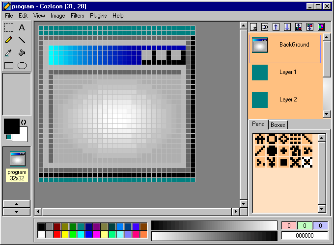



## CozIcon v1\.1 \- True Color Icon Editor

### Description

Newest version of CozIcon.

----

Now can open/save icons with multiple icons inside and also edit 48x48 icons. Also new to CozIcon is Filters, many premade filters come bundled but you can create your own(this is made easier with the Filter Maker Plugin/Stand Alone program). An example plugin is now included highlighting the new features available to plugin makers. In addition CozIcon now supports a layer system while editing icons. Custom brushes are easier to access now that they're displayed on the main window. And quite a bit more features. This release may contain bugs and I ask that you post any that you find below, thanks. And don't forget to compile the plugins and check them out! 

----

FIXED

----

----

Old version here: http://www.planet-source-code.com/vb/scripts/ShowCode.asp?txtCodeId=59233&lngWId=1
 
### More Info
 

             |
---                |---
**Submitted On**   |2005-04-04 06:31:08
**By**             |[DoWnLoHo](https://github.com/Planet-Source-Code/PSCIndex/blob/master/ByAuthor/downloho.md)
**Level**          |Intermediate
**User Rating**    |5.0 (120 globes from 24 users)
**Compatibility**  |VB 6\.0
**Category**       |[Complete Applications](https://github.com/Planet-Source-Code/PSCIndex/blob/master/ByCategory/complete-applications__1-27.md)
**World**          |[Visual Basic](https://github.com/Planet-Source-Code/PSCIndex/blob/master/ByWorld/visual-basic.md)
**Archive File**   |[CozIcon\_v1187206442005\.zip](https://github.com/Planet-Source-Code/downloho-cozicon-v1-1-true-color-icon-editor__1-59821/archive/master.zip)

